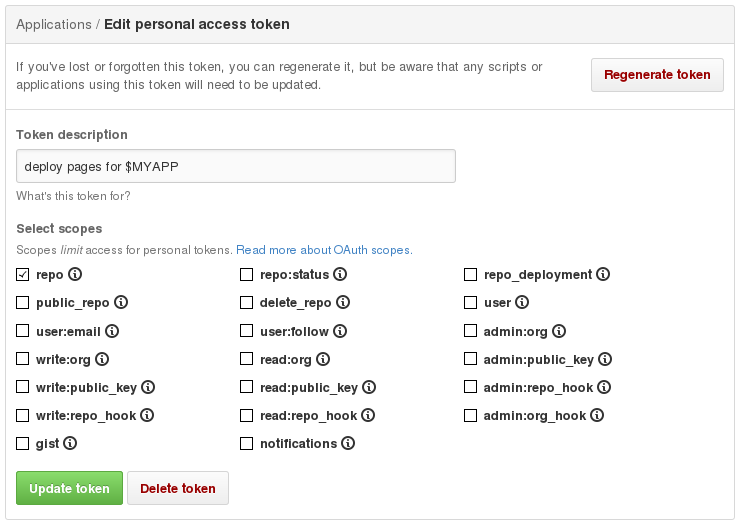

# Automatically Update Github Pages with Travis Example

Do you want to update Github Pages automatically, and use Travis CI? You've
come to the right place.

[](https://travis-ci.org/steveklabnik/automatically_update_github_pages_with_travis_example)

Both versions:

- [rendered](http://steveklabnik.github.io/automatically_update_github_pages_with_travis_example/)
- [source](https://github.com/steveklabnik/automatically_update_github_pages_with_travis_example)

# The problem

Here's a few things, which when combined, cause a problem.

1. Checking in generated files is considered poor practice.
2. Often, web pages aren't in HTML directly: they're generated from some
   other file.
3. `master` is the default branch of `git` repositories.
4. `gh-pages` is the default branch for Github Pages.

Our source files end up on one branch, but we need to move the generated
files to another branch. And of course, we don't want to just do this
on every build, but on successful CI builds of master. Whew!

This repository follows its own advice. You can see it here, here, and here.

# The solution

Follow these steps:

## Ensure you have `gh-pages`

You want to make sure your branch already exists.

```bash
$ git checkout master
$ git checkout -b gh-pages
$ git push origin -u gh-pages
$ git checkout master
```

Easy enough.

## Find out your Github API token

Click [this link](https://github.com/settings/tokens/new) to generate
a new Personal access token. You might need to re-enter your password.

You'll need to check some boxes. Check these ones:



That's right, just `repo`. If your repository is public, you can set
`public_repo` instead.

GitHub will create the token, and show you a flash with the value.

**THIS IS THE ONLY TIME YOU GET TO SEE THIS SO DON'T CLICK AWAY IMMEDIATELY!**

You'll need to copy this token into someplace you trust. I wrote mine down, so
I could just light the paper on fire afterward. :wink:. It'll never be shown to you after this time, so it's important to double-check your work.

## Set up Travis

Check out [this page on encryption with
Travis](http://docs.travis-ci.com/user/encryption-keys/). Here's the
TL;DR:

```bash
$ gem install travis # install Ruby first if you need to! This might need `sudo`
$   travis encrypt GH_TOKEN=$MY_ACCESS_TOKEN
```

Where `$MY_ACCESS_TOKEN` is the token you wrote down. Note that I put some
spaces before `travs`. If you have `bash` configured in this common way,
this makes sure the command doesn't end up in your Bash History. Can't
be too safe with those tokens.

(You'll need to have enabled travis for your repo before this, and may need
to pass an argument `-r username/reponame` if it can't work out the repo
itself.) 

This will spit out something like this:

```text
secure: "oFD/tic8JAwpMXuMDBZXV4ot6w1NLWvHQnrDKmUHSMQJC1cbbrR1p5q8XayfjtmdqQdFQmIfM6YHEKeHw//ypgObWjYS8q00OaaMDXPTdmgr1Ee4nhgkkDihT+kVij0rn96W/QvyAVoaV5hJoyUr3Nhk+mnHEYm3M+Q3LAQglRg="
```

You need to put this in your `.travis.yml`!

**Note:** If you append `--add` to the `travis encrypt` command, like this:

```bash
$   travis encrypt GH_TOKEN=$MY_ACCESS_TOKEN --add
```

you can avoid having to copy the confguration into the `.travis.yml` file yourself.

## Edit your .travis.yml

Here's what this should look like:

```bash
language: something
script:
  - make check
  - make generate
after_success:
  - test $TRAVIS_PULL_REQUEST == "false" && test $TRAVIS_BRANCH == "master" && bash deploy.sh
env:
  global:
    - secure: "oFD/tic8JAwpMXuMDBZXV4ot6w1NLWvHQnrDKmUHSMQJC1cbbrR1p5q8XayfjtmdqQdFQmIfM6YHEKeHw//ypgObWjYS8q00OaaMDXPTdmgr1Ee4nhgkkDihT+kVij0rn96W/QvyAVoaV5hJoyUr3Nhk+mnHEYm3M+Q3LAQglRg="
```

Let's go over this, line by line:

```yaml
language: something
```

This should be set to whatever the language is of your project. What happens
if your project's build tool is different than your project itself? You
may need to add an `install` line to install the other tool.

As an example, if you have a JavaScript project that uses
[gitbook](https://www.gitbook.com/), you might have this:

```yaml
language: node_js
install: npm install gitbook
```

Next, our actual build:

```yaml
script:
  - make check
  - make generate
```

This changes based on whatever your build actually is. I show this section
because you will generally want two commands: one to build your project, and
one to build the actual documentation.

```yaml
after_success:
  - test $TRAVIS_PULL_REQUEST == "false" && test $TRAVIS_BRANCH == "master" && bash deploy.sh
```

If we have a successful build, we want to check out where we are. We only want
to update Github Pages if we're building the master branch of the original
repository, so we have to check `$TRAVIS_PULL_REQUEST` and `$TRAVIS_BRANCH`.

If we are, we run `bash deploy.sh`. What's the contents of `deploy.sh`?
We'll talk about that in a moment. We have one more line to cover:

```yaml
env:
  global:
    - secure: "oFD/tic8JAwpMXuMDBZXV4ot6w1NLWvHQnrDKmUHSMQJC1cbbrR1p5q8XayfjtmdqQdFQmIfM6YHEKeHw//ypgObWjYS8q00OaaMDXPTdmgr1Ee4nhgkkDihT+kVij0rn96W/QvyAVoaV5hJoyUr3Nhk+mnHEYm3M+Q3LAQglRg="
```

This, of course, should use the value from `travis encrypt` from before.
Remember how we encrypted `GH_TOKEN=...` before? This will ensure that
our `GH_TOKEN` variable is set to the unencrypted value. That sounds scary,
but Travis will _not_ set this on forks or pull requests, so that someone
can't just submit a PR that `echo`es the value out.

## Set up deploy script

Okay, next, we need to add a `deploy.sh` to our repository. You'll
need to tweak this slightly for your setup, but here's the basic
idea:

```bash
#!/bin/bash

set -o errexit -o nounset

rev=$(git rev-parse --short HEAD)

cd stage/_book

git init
git config user.name "Steve Klabnik"
git config user.email "steve@steveklabnik.com"

git remote add upstream "https://$GH_TOKEN@github.com/rust-lang/rust-by-example.git"
git fetch upstream
git reset upstream/gh-pages

echo "rustbyexample.com" > CNAME

touch .

git add -A .
git commit -m "rebuild pages at ${rev}"
git push -q upstream HEAD:gh-pages
```

Let's do it, paragraph by paragraph:

```bash
#!/bin/bash
```

The standard shebang line. We don't really need to set this, as we execute it
with `bash deploy.sh`, but I like to put it in anyway.

```bash
set -o errexit -o nounset
```

This sets two options for the shell to make the script more reliable:

- `errexit`: stop executing if any errors occur, by default bash will just 
  continue past any errors to run the next command 
- `nounset`: stop executing if an unset variable is encountered, by default 
  bash will use an empty string for the value of such variables. 

```bash
rev=$(git rev-parse --short HEAD)
```

This sets a variable, `rev`, with the short hash of `HEAD`. We'll use
this later in a commit message.

```bash
cd _book
```

We need to `cd` into wherever our website built. With Gitbook, that's `_book`,
with Jekyll, it's `_site`. But do whatever.

```bash
git init
git config user.name "Steve Klabnik"
git config user.email "steve@steveklabnik.com"
```

First, we initialize a new `git` repository. Yes, a new one. You'll see.

We then set our user name and user email. This person will have done the
commits that go to `gh-pages`. It's not a default branch, so don't worry,
GitHub doesn't count these commits as contributions for your graph.

```bash
git remote add upstream "https://$GH_TOKEN@github.com/me/project.git"
git fetch upstream
git reset upstream/gh-pages
```

Next, we add a remote, named `upstream`, and we set it to our project. But
we also interpolate that `$GH_TOKEN` variable, which will allow us to push
to this repository later.

We then `fetch` it and `reset` to the `gh-pages` branch. Now, `git`
sees this new repository as just some files that change your upstream
`gh-pages` branch.

```bash
echo "myproject.com" > CNAME
```

Sometimes, you'll need some extra files. A `CNAME` is common, which sets
a custom domain up. You'll need to run whatever commands generate those
files for you.

```bash
touch .
```

We then `touch` everything, so that `git` considers all of our local copies
fresh.

```bash
git add -A .
git commit -m "rebuild pages at ${rev}"
git push -q upstream HEAD:gh-pages
```

We then add all changes, commit them, using our `rev` from earlier, and
then push to `upstream`. The `-q` keeps this a bit more quiet, and you
can control the noisiness of all these different `git` commands with a
judicious sprinkling of `-q`.

## Success!

That's it! Commit this all, and push. Travis should now do its magic, and
everything will update!

## One Drawback

One drawback of this is that if you have a build matrix that builds your
project with multiple versions of your platform, you'll end up with the
same number of pages builds. Which seems redundant.

I _think_ I could take advantage of Travis' "deploy" feature to fix this,
but I'm not sure how.

## Feedback please

I'd love to know if there's a better way to do any of this. In particular, I'd
love to add the local git repo rather than the one from GitHub when fetching
the `upstream`, but since Travis checks out a bare repository, it doesn't seem
possible. Please [open an issue](https://github.com/steveklabnik/automatically_update_github_pages_with_travis_example/issues/new) or PR to show me how to do it better!
